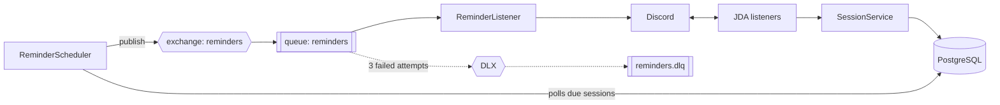

# Mesa Pronta

[](https://github.com/Lucas-blip-png/mesa-pronta/actions/workflows/ci.yml)

A Discord bot that schedules tabletop RPG sessions, tracks who's coming and reminds players before the game starts.

> Demo GIF (`docs/demo.gif`) coming soon.

## Features

- **`/agendar`**: schedule a session with title, date (`dd/MM/yyyy HH:mm`, America/Sao_Paulo) and number of seats.
- **Attendance buttons**: players click **Confirmar** / **Sair** on the session message. The last seat can never be taken twice.
- **Reminders**: the channel gets a message mentioning confirmed players 24h and 1h before the session.
- **`/mesas`**: lists the next sessions scheduled in the server, with open seats.
- **`/rolar`**: dice roller supporting expressions like `2d6+3`.

## Architecture



## Design decisions

- **No double booking on the last seat.** Joining runs in a transaction that locks the session row (`SELECT ... FOR UPDATE`) before counting seats, backed by a `UNIQUE(session_id, user_id)` constraint. An integration test fires 20 concurrent joins at a single seat and asserts exactly one succeeds.
- **Polling + `SKIP LOCKED` instead of a TTL delay queue.** With per-message TTL, a 24h reminder at the head of the queue blocks the 1h reminders behind it (head-of-line blocking). A scheduler polls due sessions every minute with `FOR UPDATE SKIP LOCKED`, so multiple instances can run safely, and publishes them to RabbitMQ.
- **Retry + dead-letter queue.** The consumer makes 3 attempts with exponential backoff, then the message is rejected to a DLX and parked in `reminders.dlq` for inspection instead of being lost or retried forever.

## Tech stack

Java 21 · Spring Boot 4 · Spring Data JPA · PostgreSQL · Flyway · RabbitMQ (Spring AMQP) · JDA · JUnit 5 · Mockito · Testcontainers · Docker · GitHub Actions

## Running locally

Requires Docker and a bot token from the [Discord Developer Portal](https://discord.com/developers/applications).

```bash
cp .env.example .env   # fill in DISCORD_TOKEN
docker compose up --build
```

RabbitMQ management UI: http://localhost:15672 (guest / guest).

## Running tests

```bash
./mvnw verify
```

Integration tests use Testcontainers, so Docker must be running.

## Roadmap

- [ ] Deploy on Railway
- [x] `/mesas` command to list upcoming sessions
- [ ] Demo GIF

## License

[MIT](LICENSE) © [Lucas](https://github.com/Lucas-blip-png)
